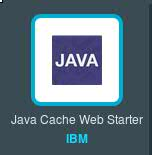

## Instructions to deploy the Acme Air sample application on Bluemix 

If you do not already have an account, sign up for one on [IBM Bluemix](http://www.ibm.com/cloud-computing/bluemix). 

### Deploying the application to use the Data Cache service 

#### Select the Bluemix Services

After logging on to the IBM Bluemix web Dashboard, go to the catalog and choose the Java Cache Web Starter under BoilerPlates 



Give it a name of your choosing (for this example we will use *acmeair-sample*) however your name will need to be unique on Bluemix. Make your choices for the Selected Plan, and press the Create button. 

#### Build the Application

While the IBM Bluemix application & services are being created, build the web artifact for deployment.  

```text
cd %ACMEAIR_SRCDIR%
./gradlew -Pservice=wxs build
```
The "-Pservice=wxs"  parameter tells the build tool that you would like to package the web archive with the data caching service, acmeair-services-wxs. 


#### Push the Application

Once the artifact has been build, you can deploy it to Bluemix. 

**note:** These instructions will use the Cloud Foundry command line interface to deploy Acme Air.  You can also use other methods to deploy applications to Bluemix, like the "Eclipse Tools for Bluemix", however these instructions will not cover all of the other possible methods. 

If you have not done so already, download the [Cloud Foundry command line interface](https://github.com/cloudfoundry/cli/releases)


```text
cf api api.ng.bluemix.net
	 
cf login

cf push acmeair-sample -p acmeair-webapp/build/libs/acmeair-webapp-1.1.0-SNAPSHOT.war
```

**note:** Replace *acmeair-sample* with the name you had given the application above  

Wait for the push process to complete, and you see the message  in the Bluemix web dashboard.  Once the application push has completed, you can access the application using the url provided by Bluemix. 

